# ControlNet Pro

The most expressive ControlNet extension for **Forge Neo**.

A control usually reaches you as a weight slider and a start/end range: one
number and one interval, for a mechanism that acts across *space*, across
*sampling steps*, and across *network depth*. CNPro opens all three, with editors
built for them — a curve editor for the step axis, a paint tool for the spatial
one, a second plot for depth. Then it lets you stack units, give each one its own
prompt, and mask each one to its own region of the output.

Where the leverage comes from: a ControlNet does not hand the model one nudge, it
injects a *residual at every layer it is wired into*, at every sampling step, and
those residuals simply **add** — which is why several controls compose in the
first place. Those injection sites are ordered by depth: the deep ones decide
composition and pose, the shallow ones decide texture and surface. A single
weight collapses that whole field into one scalar. **A profile is a curve over it
instead** — one over steps, one over depth, one painted over the image — and the
unit runs their product. The field was always there; CNPro is the instrument
built to play it.

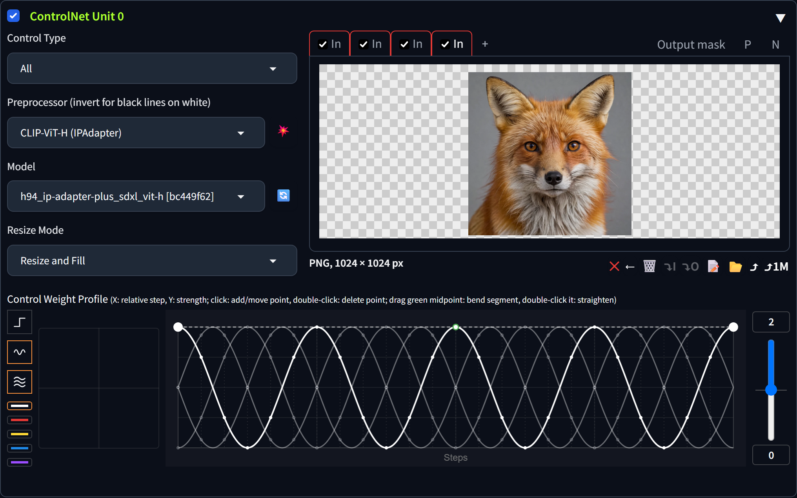

> **New here? Start with the worked examples —
> [ahrvoje.github.io/cnpro](https://ahrvoje.github.io/cnpro/).** Each one builds a
> picture one setting at a time and shows the unit panel exactly as it was set, so
> you can see what every control did before you touch it yourself.

---

## The three axes

|  |  |
|---|---|
| **Space** — paint control strength straight onto the image. Rainbow hue is the weight, red 1 → violet 0; brush size, feathering and an eraser are in the same menu. Four independent mask slots per input: one global, three per depth band — a mask is a profile's spatial half, so which slots are live follows the profile selector rather than being a second switch to keep in sync. Anything painted means the control never escapes the paint. | 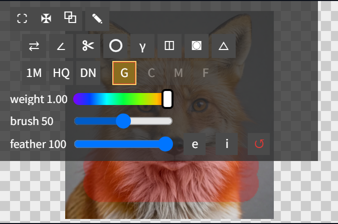 |
| **Steps** — a curve editor. Click to add points, drag to move, double-click to delete; drag a segment's green midpoint to bend it into a parabola. Down the left: the step preset, and one oscillatory button cycled through cosine and the three multi-phase partitions. A vertical response slider bends the whole curve toward high or low values, and the range selects reach down to **−1**, where the control actively pushes away. The dotted verticals are your real step cells; the dot on each curve is the value that step reads. | 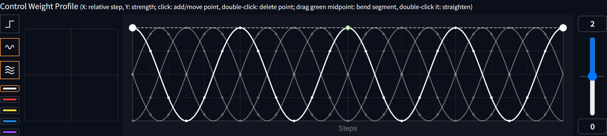 |
| **Depth** — its own plot, its own axis: X is the injection layer from fine to coarse, Y a per-layer multiplier. Draw it and the unit runs your step curve *times* your depth curve — a time curve and a depth curve, separable, both yours. | 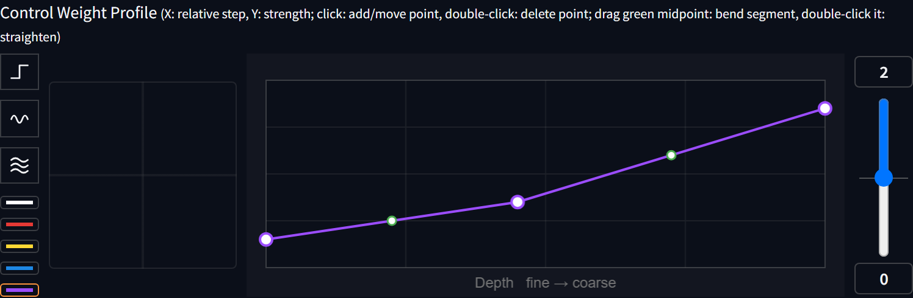 |

Prefer buckets to a curve? The same depth axis is quantized into three **band
profiles** — coarse / mid / fine, one step curve each, drawn together on one
plot, selected by the coloured buttons under the presets.

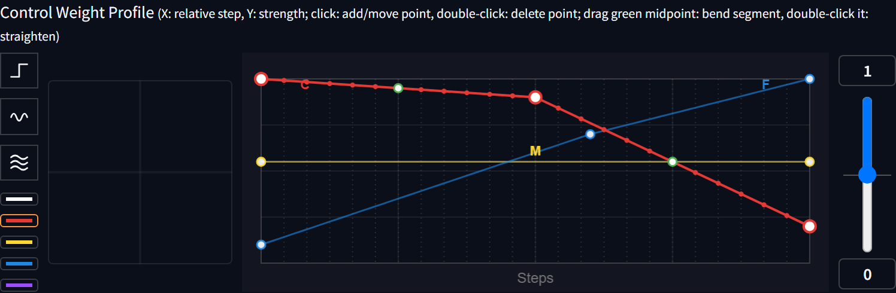

### The two axes, coupled

A step curve *times* a depth curve is separable, and separable has a cost: the
depth shape is frozen in time. Whatever leads on step 1 still leads on the last
step — you can say "the deep layers matter more", never "the deep layers matter
first". The band profiles buy that freedom by quantizing depth into three
buckets. The green **S** selector buys it without quantizing anything.

Draw a curve over the steps and its height shifts *where the depth curve is
read*: the unit runs **main(step) × depth(layer − drift(step))**. A descending
drift sweeps the control from composition to texture as sampling proceeds — the
deep layers lead while the image is being decided, the shallow ones take over
while it is being finished, and the depth curve you drew is the shape that
travels. Its neutral is 0, not 1, so it gets its own plot and its own range.

It moves a depth curve and nothing else, so a drift with a flat depth curve does
nothing at all — and says so in the log rather than failing quietly.

---

## Multi-phase amalgamation

**This is the feature to steal.** A unit takes up to five **Input** tabs. Each
one is preprocessed on its own and patched in as its own control on the same
UNet — a unit is no longer "one image, one control", it is a small ensemble.

Run that ensemble flat and every reference pulls on every step. They compete, and
the model resolves the fight by *stitching*: each donor arrives as a patch, with
an edge where it meets the next one.

**Multi-phase** hands them the schedule instead. Click the oscillatory button
past plain cosine and each input runs the same wave shifted a little further
along, so they take turns steering — input 1 opens on the first step where
composition is decided, the rest come in behind it. The pad sets how many waves
cross the schedule; the editor draws a ghost curve per loaded input so you can
see the hand-off before you generate. Their pulls still sum to exactly the
envelope you drew, so adding a fifth reference does not quietly make the unit
weaker.

The button keeps cycling through three ways of dividing that one wave. **Cosine**
is the original soft overlap. **Fejér** (`F`) hands over cleanly — at each
input's moment the others are exactly zero, not merely small, which matters from
three references up where the cosine has them all leaking at once. **von Mises**
(`M`) makes the overlap itself the dial: the pad's x-axis becomes κ, from every
input equally on at 0 to near-hard switching at 10.

The result is not a blend of images. It is one thing that looks like it grew that
way.

### Two references, one object

Strength decides how hard a reference pulls. The schedule decides **what it gets
to pull on.** An object's identity is settled in the first handful of steps and
its surface in the last, so a reference given the early steps chooses what the
thing *is*, and one given the late steps chooses what it is *made of*. Run them
flat and neither chooses: both pull on everything, and the model settles the tie
by stitching one onto the other. Multi-phase hands them the schedule instead —
the same total pull, one reference in charge at a time, a hand-off in between.

Which is why the useful dial is the **wave count**, not the weight. Input 1 opens
the composition, and more waves means it holds it for less time: one wave gives
it half the schedule to establish what the object is, four waves an eighth. Turn
that up and you are not smoothing a blend, you are handing over the decision.

Each row below is one unit with two Input tabs — no second unit, no masks, no
hint. Only the oscillatory button moves.

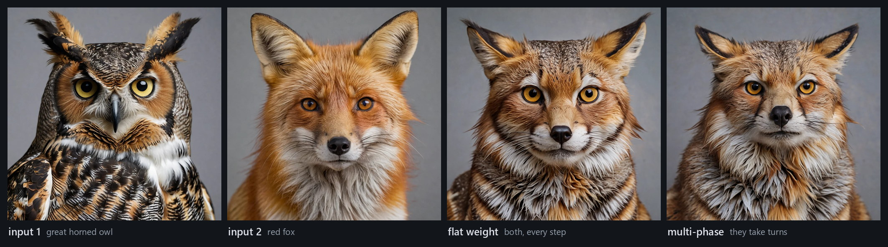

Owl and fox: flat grafts a bib onto a face, multi-phase makes plumage and fur one
coat.

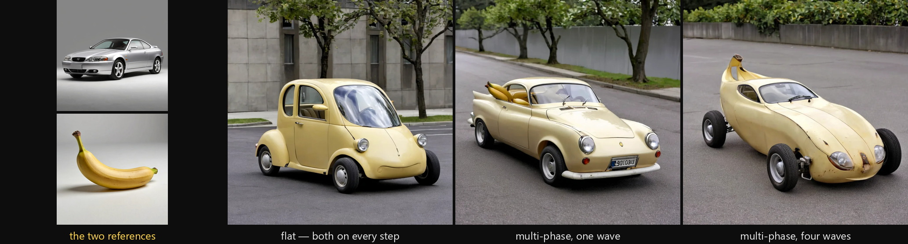

Car and banana: flat only repaints the car, one wave puts the fruit *in* it, four
waves makes the body itself a banana — wheels, glass and lights still on it.

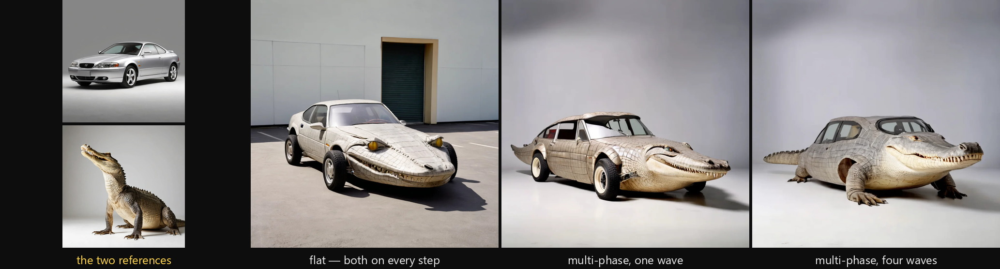

Car and crocodile: flat bolts a snout to the bonnet with the seam across the
windscreen, one wave is the transformation, four waves lets the crocodile take
the composition back and stand up on its feet.

And it scales past two. Five inputs per unit, each with its own masks, each
taking a share of the *same* drawn envelope — so the fifth reference is added
without stealing from the four already there.

### Four working adults, and the depth curve on top

Same machinery on people, and now with the second axis engaged. A chef, a
carpenter, a doctor and a teacher go in. All four outputs run the *same* four
references through the *same* one-wave interleaving — the only thing that moves
along the bottom row is the depth curve on the purple plot.

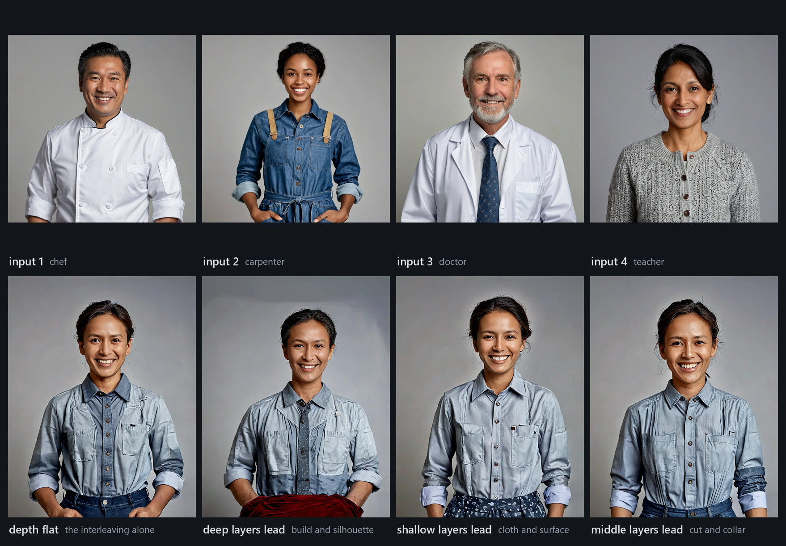

Worth knowing before you try it: **four faces average into one plausible person
no matter how you schedule them.** People converge where animals and cars
diverge — the model has a much stronger prior for "one human face" than for
"one creature" or "one vehicle".
What the depth curve still buys you is everything *around* that face: which
reference's build, cut and cloth survives. Deep layers leading brings the
doctor's collar and the carpenter's apron into one silhouette; shallow layers
leading brings their fabrics and patterns on a lighter frame; the middle of the
stack trades the collar and the cut.

Reorder the inputs with the ← button under the canvas: input 1 gets the
unshifted wave, so which reference opens the composition is a creative decision,
not bookkeeping. Un-tick an input's checkbox in its tab title to A/B it without
clearing anything.

<sub>Animals and people: IP-Adapter Plus SDXL on RealVisXL V5.0 Lightning, 8
steps, DPM++ SDE Karras, CFG 2 — animals at plot range 0 → 2, people at 0 → 1.4,
896×1152. Cars: IP-Adapter ViT-H on thisisrealSDXL v3.0 + sdxlVAE, 30 steps,
DPM++ 2M Karras, CFG 5, 1024², one unit with two Input tabs (car first), Fejér
partition, one seed per figure across all three panels — crocodile on a flat
envelope at plot range 0 → 2, banana on an envelope rising 0.25 → 1, which is
what keeps the car a car. Every
reference was generated by the same model — no external assets, no real people,
no real vehicles.</sub>

---

## Partition of unity

The reason adding a fifth reference does not quietly halve the fourth.

Multi-phase gives every input the *same* drawn wave, shifted. The obvious way to
combine them — average — costs you the curve you drew: five inputs at 1/5 each
never pull as hard as one input did, and the unit gets weaker every time you add
a reference. The fix is to stop treating the inputs as competitors and treat the
wave as something to **divide**. Each input takes a share of it, and the shares
add up to a constant at *every* step. Nobody is amplified, nobody is starved, and
the total pull the model feels is exactly the envelope on the plot — whether that
envelope is split two ways or five.

That constant-sum property is what "partition of unity" means, and it is the only
thing the three families below actually have in common. They differ in *how* the
share is handed from one input to the next.

<picture>
  <source media="(prefers-color-scheme: dark)" srcset="resources/partition-of-unity-dark.png">
  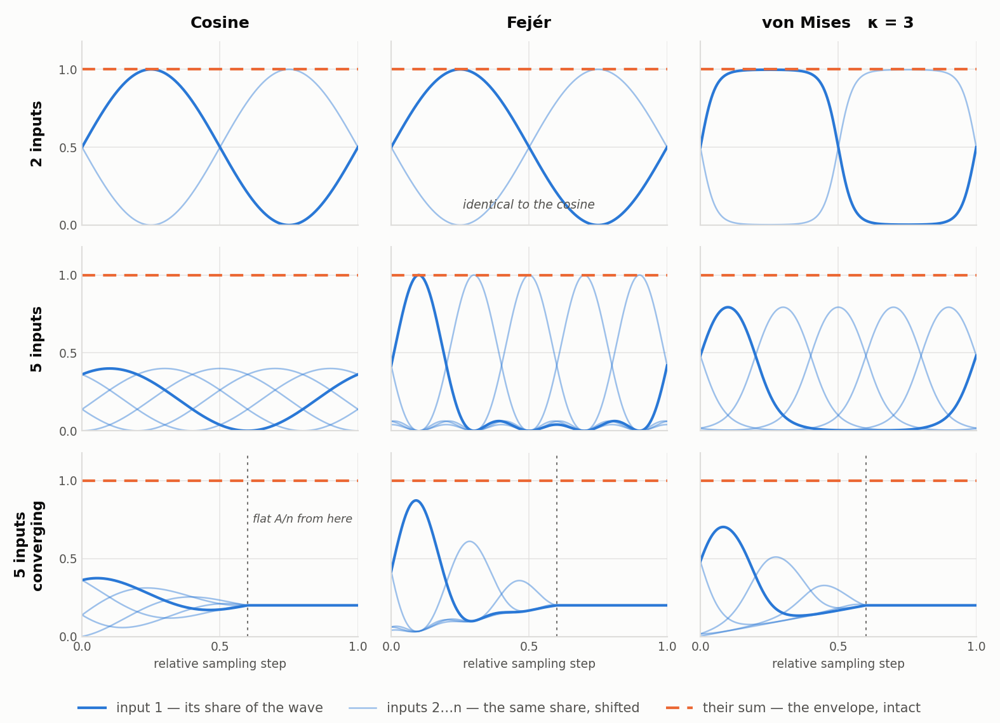
</picture>

The solid curves are what the editor plots — each input's wave at full height,
the shape you draw against. The dashed line is the other quantity: what the unit
actually delivers once the shares are applied, flat at the envelope in every
panel. The editor shows you shape; the correction happens at generation.

**Cosine** — the original. A soft, wide overlap: each input eases in as the
previous eases out. Read the bottom-left panel, though. At five inputs no one is
ever really in charge — when input 1 is at its peak both of its neighbours are
still at 0.65, and there is no moment in the schedule where a single reference
has the step to itself. That is most of the way back to the flat average
multi-phase exists to escape. Fine for two or three inputs, increasingly nominal
past that.

**Fejér** (`F`) — the clean hand-off, built from the
[Fejér kernel](https://en.wikipedia.org/wiki/Fej%C3%A9r_kernel). At each input's
moment the others are *exactly* zero, not merely small, so the wave genuinely
passes from one reference to the next. It has no setting of its own: the shape
follows from how many inputs you loaded. At two inputs it is mathematically
identical to the cosine — the two top panels are the same picture — so switching
costs you nothing and only starts to matter from three references up. If you are
unsure which to use, use this one.

**von Mises** (`M`) — the overlap becomes the dial. Not the probability
distribution of that name: this takes its `exp(κ·cos)` kernel and normalizes it
across the *n* phase positions instead of integrating it over the circle, so the
shares sum to 1 by construction rather than by a lucky identity. Input *j*'s
share at wave angle θ is

```
w_j(θ) = exp(κ·cos(θ − 2πj/n)) / Σ_k exp(κ·cos(θ − 2πk/n))
```

κ runs the pad's x-axis: at 0 every input is equally on (plain averaging, the
thing you were avoiding), at 3 you get the rounded hand-off above, and by 10 it
is near-hard switching — one reference at a time, with a smooth seam. Reach for
it when neither the cosine's permanent blur nor Fejér's fixed sharpness is what
the image wants.

---

## Worked examples

Everything above is the argument. **[ahrvoje.github.io/cnpro](https://ahrvoje.github.io/cnpro/)**
is the demonstration: complete walk-throughs where each step is one picture
answering one question, every value is shown as the actual unit panel rather than
written out, and the settings that *failed* are kept in for the reason they
failed.

- **[1 · The banana car](https://ahrvoje.github.io/cnpro/example_1.html)** — canny
  holds a photograph's composition while an IP-Adapter reference takes over its
  body. The **band profiles** example: why a single weight cannot say "bend the
  shape but keep the layout", and why the coarse band's usable window turns out to
  be about 0.06 wide.
- **[2 · Four workers, one person](https://ahrvoje.github.io/cnpro/example_2.html)**
  — four professionals amalgamated into one and placed in a workshop that **canny
  and depth build between them**, handing over through their step profiles. All
  three **partitions of unity** compared on the same seed, including what a flat
  average costs you.

Reproducible on any SDXL checkpoint; every reference image in them was generated
by the same model, so there is nothing to download.

---

## Units stack

One unit is not the story. **Units combine**, and a unit is only a *kind* of
control — geometry, depth, identity, style. Each one carries its own hint, its
own model, its own profiles, its own masks and its own prompt, and CNPro gives
you the last piece the stack was missing: **an output mask per unit**, so a
control can be told not just how hard to pull but *where in the picture it is
allowed to*.

### Different kinds of unit: canny + IP-Adapter

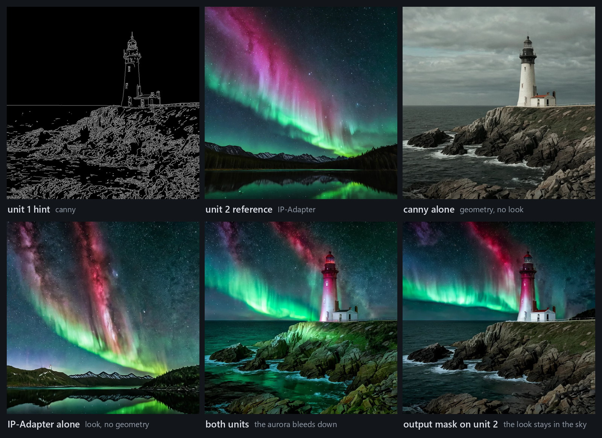

Canny alone holds the geometry and nothing else — grey daylight, no aurora.
IP-Adapter alone brings the whole look and loses the lighthouse. Together you get
both, but the aurora bleeds down into the rock and the sea until the whole frame
is teal. Paint an output mask over the sky on unit 2 and the look stays where you
put it: aurora above, natural rock and water below, structure crisp throughout.

That is the loop worth internalising — **stack for capability, mask for
placement.**

### One object per unit: an apple and a pear

Three units. Unit 1 is a canny hint of a table with two fruits on it — that is
the geometry, and nothing else. Units 2 and 3 are IP-Adapters, one holding a
green apple, one holding a red pear, each masked to its own fruit.

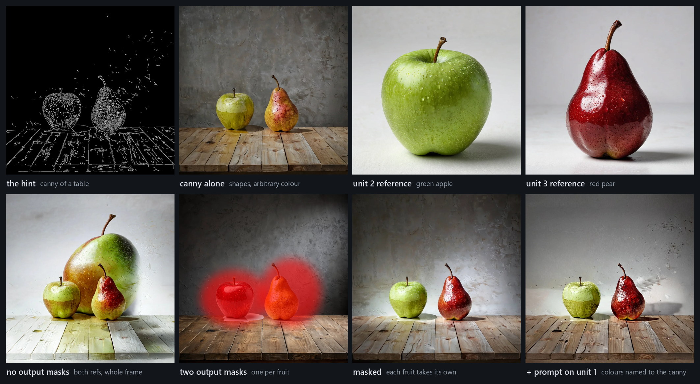

Canny alone puts two fruits in the right shapes and picks their colours at
random. Add both references with no masks and they have nowhere to land, so a
ghost fruit smears across the whole frame. Paint one output mask per fruit and
each reference goes exactly where you put it — green on the left, red on the
right, both still in the silhouettes the hint drew.

The last panel adds the fourth ingredient. Canny is a **real ControlNet**, so it
has its own cross-attention and CNPro gives it its own **P** and **N**
textboxes — here, *"a bright green apple on the left and a deep red pear on the
right"*. That text is encoded with the model's own text encoder and fed to the
control branch *in place of* the main prompt: the UNet still sees what you typed
at the top, but this control now reads its edges through different words.
Embedding strength, effect scale and a retention ramp set how hard it argues.

**Object-level control without a second pass, an inpaint, or a mask on the
latent.** Same hint, same seed, same main prompt in all four.

<sub>Canny weight 0.85, IP-Adapters 1.1, unit prompt at embedding strength 2.2,
effect scale 1.8, retention 1.0. Push those past roughly 2.6 / 2.0 and the
control branch stops producing a photograph — the useful band is narrow and worth
sweeping.</sub>

---

## One hint, three axes

One canny hint of a calm lighthouse. One prompt asking for a violent storm. The
only thing that changes between the panels is *how* the hint is scheduled.

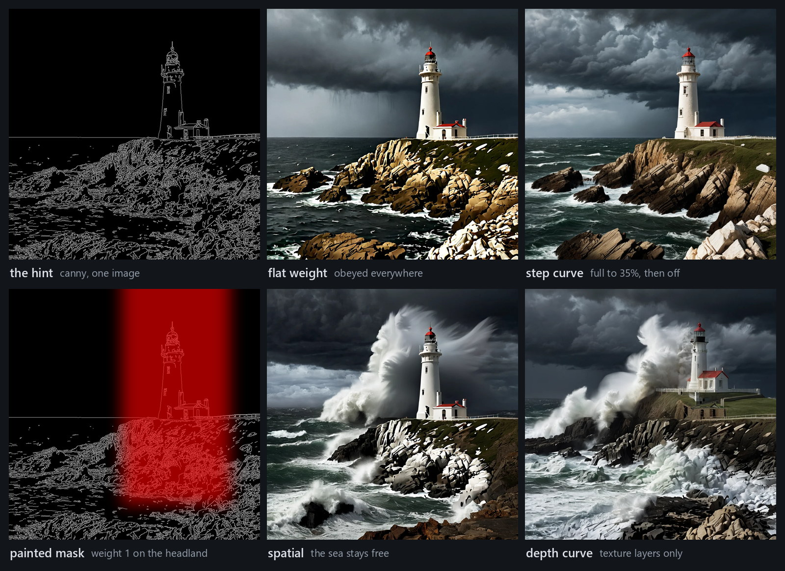

- **flat weight** — the classic. The hint wins everywhere, including the sea, so
  the storm you asked for never really arrives.
- **step curve** — drag the curve to zero at 40%. The hint sets the composition
  and then lets go. Same layout, real weather, real rock.
- **spatial** — paint the headland at full weight, leave the rest of the canvas
  unpainted. That structure is held exactly; the sea is free to break.
- **depth curve** — press the purple selector, keep the fine layers up and pull
  the coarse ones to zero. The hint's *surface* lands everywhere while the camera
  and the framing go wherever they like.

---

## The canvas is a tool in its own right

The image canvas is not an upload box with a clear button. It is a small
compositor, and it runs *before* the preprocessor, so anything you do here is
what the control model sees.

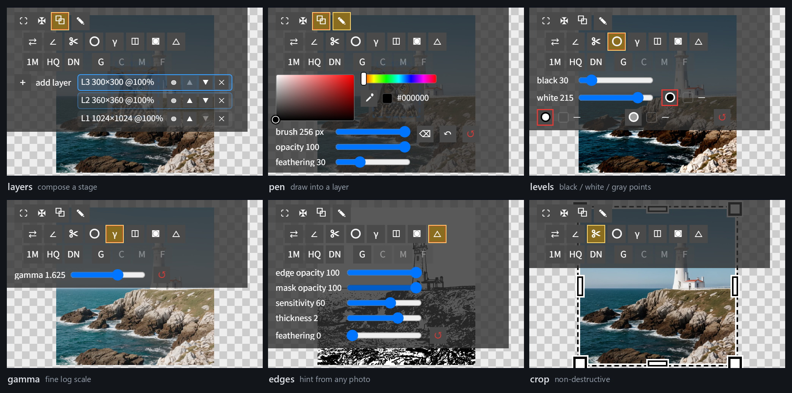

- **Layers** — stack images on one stage. Drop, paste or push an image in as a
  new layer, click to select, drag to move, wheel to scale around the pointer,
  reorder and delete in any order. Every tool below operates on the flattened
  composite.
- **Pen** — draw straight into the active layer with a full colour picker,
  eyedropper, brush size, opacity and feathering, plus an eraser that cuts to
  transparency so lower layers show through. Per-stroke undo.
- **Levels and light points** — black and white point sliders, and three
  pickers: click a black point, a white point, or paint over neutral areas and
  let it kill the colour cast without touching brightness.
- **Gamma** — one wide slider on a fine logarithmic scale, double-click to
  reset. Enough range to rescue a hint that is nearly black.
- **Edges** — turn any photograph into a black-lines-on-white hint right on the
  canvas: edge opacity, mask opacity, sensitivity, line thickness and feathering,
  all live. Line weight follows edge prominence, so it degrades gracefully
  instead of turning to noise. Pair it with the invert toggle when a model wants
  the other polarity.
- **Crop, rotate, flip, grayscale, invert** — all non-destructive toggles. Crop
  drags border handles and applies when you toggle it off; nothing is thrown
  away until you say so.

Every slider takes the mouse wheel, at its own step size. The whole toolbar is
one row of squares that fades in when you point at the canvas, so none of this
costs you screen space while you are not using it.

---

## Everything else in the box

- **Balance profile** — a per-step curve for how much of the control lands on the
  conditional side versus the prompt side. Replaces the three-way Control Mode
  radio with something you can actually shape.
- **Per-input mute** — a checkbox in each Input tab's title. A/B a reference
  without clearing its canvas or its masks.
- **Detected-map cache** — preprocessor outputs are reused across Generate
  clicks when nothing that feeds them changed.
- **Round trips** — profiles, masks and settings survive infotext, PNG Info and
  the API, and unknown pieces are skipped rather than dropped, so an old image
  still pastes into a newer build.

---

## Install

```bash
cd <your-forge-neo>/extensions
git clone <repo-url> forge-neo-cnpro
```

Then **disable the built-in `sd_forge_controlnet`** in Settings → Extensions and
restart. This is not optional: CNPro deliberately reuses the built-in's element
ids so your `ui-config.json` keys and any JS selectors keep working, and the two
cannot coexist.

Requires `opencv-python`. The OpenPose editor additionally needs the
`forge_legacy_preprocessors` extension; everything else runs without it.

---

## Model support

| Type | Step | Bands | Depth + drift | Weight masks | Output mask | Balance | Unit prompt |
|---|:-:|:-:|:-:|:-:|:-:|:-:|:-:|
| ControlNet / ControlLora | ✓ | ✓ | ✓ | ✓ | ✓ | ✓ | ✓ |
| T2I-Adapter | ✓ | ✓ | ✓ | ✓ | ✓ | ✓ | — |
| IP-Adapter (incl. InstantID) | ✓ | ✓ | ✓ | ✓ | ✓ | ✓ | — |
| ControlLLLite | ✓ | ✓ | ✓ | — | — | — | — |
| Z-Image Fun-ControlNet Union v1 / v2.1 / lite / Tile / SAM | ✓ | ✓ | ✓ | ✓ | ✓ | — | — |

Depth and drift share a column because they share a requirement: both need a
model whose control is injected at more than one depth. A patcher with a single
whole-UNet hook has nothing to scale per layer and nothing to shift.

Capabilities are declared per model family, **including the noes** — an
unsupported control warns you, it never silently does nothing. Only true
ControlNets have a text input, so the unit prompt is theirs alone; LLLite has no
mask route at all; and Z-Image is CFG-distilled, so balance reads *unavailable*
rather than neutral, because a balanced setting on a CFG-free sampler would mean
nothing.

---

## Honest limitations

- **Krea 2 is not supported and probably never will be here.** Its control is a
  Control-LoRA plus a concatenated latent — no per-layer residuals, so depth,
  bands and per-layer masks would all be dead controls.
- **Z-Image Fun-ControlNet v2.0 is refused by filename.** Its tensors are
  byte-identical to 2.1 and only the forward pass differs, so the file cannot say
  which it is. A wrong guess produces plausible wrong images forever.
- **Z-Image inpaint conditioning is plumbed but does not work** (behind
  `CNPRO_ZIMAGE_INPAINT=1`): the masked region comes back solid black.
- **A unit prompt re-conditions the control branch; it does not paint objects.**
  It changes how that control reads its hint. Pushed too far it stops being a
  photograph, and the usable range is narrower than the sliders suggest.

---

## License

GPL-3.0.

<small>

Descended from and building on work by others, with thanks:

- **ControlNet for A1111 / Forge** — Mikubill and contributors (GPL-3.0). The unit widget, the preprocessor plumbing and the API surface descend from it.
- **Stable Diffusion WebUI** — AUTOMATIC1111 (AGPL-3.0). The host, and the ForgeCanvas widget these canvas tools extend.
- **ComfyUI_IPAdapter_plus** — cubiq (GPL-3.0), by way of Forge's IP-Adapter extension. The IP-Adapter / InstantID injection path.
- **ControlNet-LLLite** — kohya-ss, by way of Forge. The LLLite injection path.
- **Fooocus** — lllyasviel (GPL-3.0). The inpaint patcher and its licensing notes.
- **Z-Image / Fun-ControlNet-Union** — Tongyi Lab and alibaba-pai (Apache-2.0). Checkpoint layout and config; the engine is re-expressed against this host's tensors.
- **"High Quality Edge Thinning using Pure Python"** — Lvmin Zhang, Stanford, 2023. Cited as the author asks.
- **stable-diffusion-ps-pea** and **sd-webui-openpose-editor** — huchenlei. The Photopea and pose-editor bridges.
- **Pytorch-Contrast-Adaptive-Sharpening** — Jamy-L. The CAS pass in the IP-Adapter path.
- **base64ArrayBuffer** — Jon Leighton, 2011 (MIT), and a base64→Blob helper by gauravmehla.

</small>
